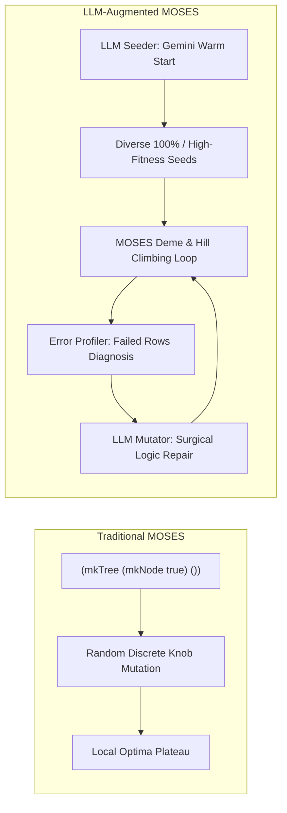
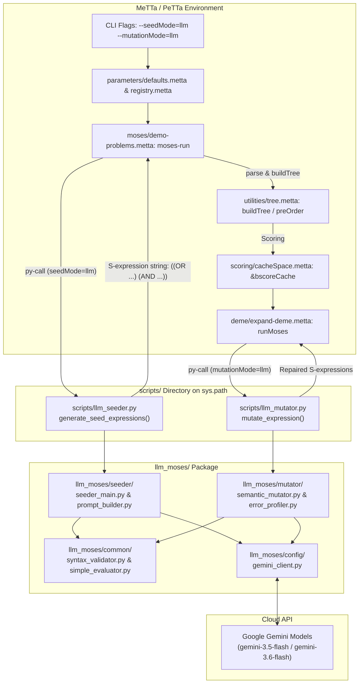
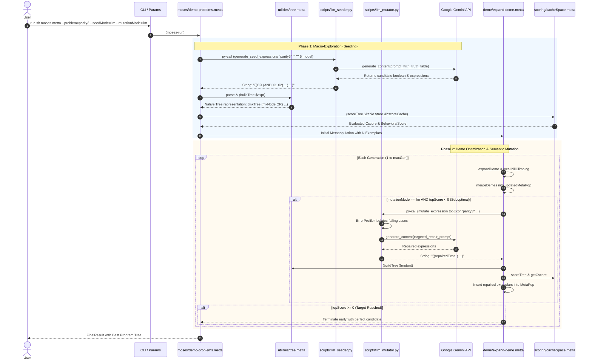

# Developer Guide: LLM Integration in MeTTa-MOSES

## 1. Overview & Motivation

### What is MeTTa-MOSES?
**MOSES** (*Meta-Optimizing Semantic Evolutionary Search*) is an evolutionary program induction algorithm that searches the space of programs (expressed as tree-structured boolean equations in MeTTa) to find equations that best fit a given dataset or objective.

Traditional MOSES operates through:
1. **Deme Expansion & Hill Climbing**: Exploring local representation spaces by perturbing discrete "knobs" (subtrees/operators).
2. **Metapopulation Management**: Culling, resizing, and merging high-scoring candidates across generations.

### Why Integrate LLMs?
Traditional MOSES has two primary bottlenecks:
* **The "Cold Start" Problem**: Generation 0 typically starts with a single trivial, constant program: `(mkTree (mkNode true) ())`. Finding a reasonable starting program requires dozens of hill-climbing steps.
* **Plateaus in Local Search**: Discrete knob flipping lacks semantic debugging capabilities. When a candidate misclassifies only 1 or 2 specific truth-table cases, random knob perturbations frequently break existing correct classifications or bloat the tree.

### The LLM Hybrid Approach
The LLM subsystem augments MOSES with semantic reasoning via Google Gemini:
1. **Macro-Exploration (Warm-Start Seeding)**: Synthesizes syntactically verified, diverse, high-fitness candidate programs upfront.
2. **Micro-Refinement (Semantic Targeted Repair)**: Isolates failing truth-table rows via an **Error Profiler**, feeds them into Gemini, and produces surgical logic fixes and anti-bloat simplifications.



---

## 2. High-Level Architecture & Interaction Flow

The integration combines a Python-based LLM engine with MeTTa via the **PeTTa / Janus Foreign Function Interface (FFI)**.



---

## 3. Detailed Component Breakdown

### 3.1 Python LLM Package (`llm_moses/`)

| Directory / Module | File | Purpose |
| :--- | :--- | :--- |
| **`config/`** | [`gemini_client.py`](file:///home/wmcode12/Project-Folders/metta-moses/llm_moses/config/gemini_client.py) | Manages Google GenAI API calls, exponential backoff, rate-limit retries (429), and fallback models. |
| | [`settings.py`](file:///home/wmcode12/Project-Folders/metta-moses/llm_moses/config/settings.py) | Configuration constants: default model names, retry limits, temperatures, and seed counts. |
| **`common/`** | [`syntax_validator.py`](file:///home/wmcode12/Project-Folders/metta-moses/llm_moses/common/syntax_validator.py) | Validates balanced parentheses, parses S-expressions into Python ASTs, and verifies allowed MeTTa Boolean grammar (`AND`, `OR`, `NOT`). |
| | [`simple_evaluator.py`](file:///home/wmcode12/Project-Folders/metta-moses/llm_moses/common/simple_evaluator.py) | Fast in-memory evaluator to benchmark candidate accuracy on truth tables before passing them to MeTTa. |
| | [`data_loader.py`](file:///home/wmcode12/Project-Folders/metta-moses/llm_moses/common/data_loader.py) | Loads problem datasets (`parity3`, `majority3`, `mux3`, or external CSV files). |
| **`seeder/`** | [`prompt_builder.py`](file:///home/wmcode12/Project-Folders/metta-moses/llm_moses/seeder/prompt_builder.py) | Formats few-shot prompts instructing Gemini to output valid MeTTa Boolean expressions. |
| | [`seeder_main.py`](file:///home/wmcode12/Project-Folders/metta-moses/llm_moses/seeder/seeder_main.py) | Coordinates prompt generation, Gemini querying, syntax validation, and returns top verified candidates. |
| **`mutator/`** | [`error_profiler.py`](file:///home/wmcode12/Project-Folders/metta-moses/llm_moses/mutator/error_profiler.py) | Runs the candidate against data rows to isolate exact misclassified inputs (False Positives / False Negatives). |
| | [`semantic_mutator.py`](file:///home/wmcode12/Project-Folders/metta-moses/llm_moses/mutator/semantic_mutator.py) | Sends the failed rows and current program to Gemini to request targeted minimal logic modifications. |
| | [`semantic_crossover.py`](file:///home/wmcode12/Project-Folders/metta-moses/llm_moses/mutator/semantic_crossover.py) | Recombines non-overlapping logic blocks from two distinct parent candidates. |
| | [`prompt_templates.py`](file:///home/wmcode12/Project-Folders/metta-moses/llm_moses/mutator/prompt_templates.py) | Prompt templates for targeted mutation and anti-bloat refactoring. |

---

### 3.2 Bridge Layer (`scripts/`)

MeTTa runs inside PeTTa/Prolog. PeTTa's `py-call` mechanism communicates with Python modules available on Python's `sys.path`.

In [`moses.metta`](file:///home/wmcode12/Project-Folders/metta-moses/moses.metta#L128), Janus adds `scripts/` to `sys.path`:
```metta
!(callPredicate (Predicate (py_add_lib_dir "scripts" first)))
```

This allows MeTTa to directly invoke:
* **`llm_seeder.generate_seed_expressions(...)`**:
  ```python
  def generate_seed_expressions(problem_name, input_file, target_feature, n_seeds, model_name) -> str:
      # Returns string: "((OR (AND X1 X2) ...) (AND X1 (NOT X2)))"
  ```
* **`llm_mutator.mutate_expression(...)`**:
  ```python
  def mutate_expression(parent_expr_str, problem_name, input_file, target_feature, n_mutants, model_name) -> str:
      # Returns string: "((repaired_candidate_1) (repaired_candidate_2))"
  ```

---

## 4. End-to-End Lifecycle & Sequence Flow

The following sequence diagram illustrates how MeTTa-MOSES and the LLM interact during a run with `--seedMode=llm` and `--mutationMode=llm`:



---

## 5. MeTTa Data Structures & Conversions

One of the most important concepts for developers to understand is how program structures transition between Python strings, MeTTa S-expressions, and internal MOSES Trees:

| Representation Level | Format | Example |
| :--- | :--- | :--- |
| **Python / LLM Output** | String S-expression | `"(OR (AND X1 X2) (AND (NOT X1) (NOT X2)))"` |
| **MeTTa Parsed AST** | Native MeTTa expression tuple | `(OR (AND X1 X2) (AND (NOT X1) (NOT X2)))` |
| **MOSES Internal Tree** | `(mkTree (mkNode op) children)` | `(mkTree (mkNode OR) (cons (mkTree (mkNode AND) ...) ...))` |
| **MOSES Exemplar** | `(mkExemplar tree demeId cscore bscore)` | Scored unit managed in the metapopulation ordered set |

### Key MeTTa Transformation Functions
* **`parse` (Built-in)**: Coerces a string from Python into a native MeTTa term:
  ```metta
  (let $exprList (parse $rawStr) ...)
  ```
* **`buildTree` ([`utilities/tree.metta`](file:///home/wmcode12/Project-Folders/metta-moses/utilities/tree.metta#L69))**: Recursively converts a parsed S-expression into a `(mkTree (mkNode ...) ...)` tree.
* **`preOrder` ([`utilities/tree.metta`](file:///home/wmcode12/Project-Folders/metta-moses/utilities/tree.metta#L28))**: Traverses a `Tree` and exports it back into a standard S-expression tuple, ready to pass back to Python for mutation.
* **`scoreTree` ([`scoring/bscore.metta`](file:///home/wmcode12/Project-Folders/metta-moses/scoring/bscore.metta#L62))**: Evaluates a tree against an `(mkITable ...)` using the memoized `&bscoreCache`.

---

## 6. Hyperparameter Configuration & CLI Usage

All hyperparameters are centrally registered in [`parameters/defaults.metta`](file:///home/wmcode12/Project-Folders/metta-moses/parameters/defaults.metta) and can be overridden via command-line flags.

### Supported Parameters

| Parameter | Type | Default | Description |
| :--- | :--- | :--- | :--- |
| `seedMode` | Symbol | `default` | Initial seeding mode: `default` (single `true` tree) or `llm` (Gemini warm start). |
| `nLlmSeeds` | Integer | `5` | Number of seed candidates synthesized by Gemini. |
| `llmModel` | String | `"gemini-3.5-flash"` | Gemini model used for synthesis and mutation. |
| `mutationMode`| Symbol | `default` | Mutation mode: `default` (classical knob search) or `llm` (semantic repair). |
| `nMutants` | Integer | `3` | Number of repaired variants generated per mutation call. |

### Example Invocations

#### 1. Classical Baseline Run (No LLM, zero API calls)
```bash
sh run.sh moses.metta -s --problem=parity3 --maxGen=10
```

#### 2. LLM Seeding (Warm-Start Initial Population)
```bash
sh run.sh moses.metta -s --problem=parity3 --seedMode=llm --nLlmSeeds=5
```

#### 3. LLM Seeding + Semantic Mutation (Full LLM-MOSES Pipeline)
```bash
sh run.sh moses.metta -s --problem=majority3 --seedMode=llm --mutationMode=llm
```

#### 4. Tabular CSV Dataset with LLM Seeding
```bash
sh run.sh moses.metta -s --inputFile=input.csv --targetFeature=target --seedMode=llm
```

---

## 7. Developer Setup & Testing Guide

### 7.1 Virtual Environment & Dependencies
Ensure your Python virtual environment has the required packages installed:
```bash
pip install google-genai python-dotenv
```

### 7.2 API Key Configuration
Create or update the `.env` file in the project root:
```ini
GEMINI_API_KEY=your_gemini_api_key_here
```

### 7.3 Running the LLM Test Suite
The standalone test runner tests all Python LLM components without needing the Prolog/MeTTa engine:
```bash
python3 llm_moses/run_all_tests.py
```
This runs 15 targeted tests across:
* Syntax validation & AST conversions
* Truth table evaluation
* Gemini API connectivity & response parsing
* Parity-3 and Majority-3 seeding accuracy
* Error profiler failure extraction
* Semantic mutation and logic repair
* Semantic crossover and anti-bloat tree simplification

---

## 8. Fault Tolerance & Fallback Strategy

The subsystem is architected with graceful degradation at every layer:

1. **Network / Rate-Limit Errors (429 / 503)**:
   - Handled inside [`llm_moses/config/gemini_client.py`](file:///home/wmcode12/Project-Folders/metta-moses/llm_moses/config/gemini_client.py) using exponential backoff with jitter.
   - Automatically attempts secondary fallback models if the primary model fails.
2. **Exhausted Retries / Offline Fallback**:
   - If the LLM call completely fails, [`scripts/llm_seeder.py`](file:///home/wmcode12/Project-Folders/metta-moses/scripts/llm_seeder.py) logs a warning and returns `"(true)"`.
   - In [`moses/demo-problems.metta`](file:///home/wmcode12/Project-Folders/metta-moses/moses/demo-problems.metta), if the parsed seed list is empty, it gracefully reverts to the classical default `(mkTree (mkNode true) ())`.
3. **Semantic Mutation Failure**:
   - In [`deme/expand-deme.metta`](file:///home/wmcode12/Project-Folders/metta-moses/deme/expand-deme.metta), if mutation fails or generates no candidates, it returns the existing metapopulation unmodified, allowing classical hill climbing to proceed uninterrupted.
