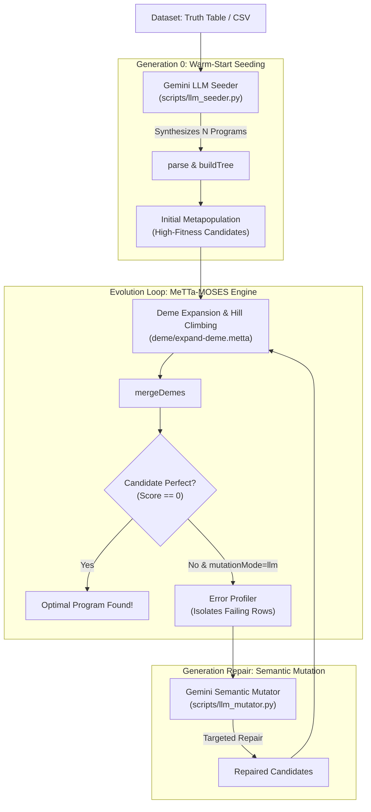

# LLM-MOSES: Executive Project Summary & Implementation Overview

## 1. Project Overview & Motivation

**MOSES** (*Meta-Optimizing Semantic Evolutionary Search*) is an evolutionary learning system implemented in **MeTTa**. It searches for concise boolean program trees that solve classification and logic tasks.

### The Problem in Traditional MOSES
1. **The "Cold Start" Bottleneck**: Classical MOSES always starts at Generation 0 with a trivial constant tree: `(mkTree (mkNode true) ())`. It requires dozens of generations of blind knob-flipping just to discover reasonable starting candidates.
2. **Local Optima Plateaus**: When a candidate is 87.5% accurate (e.g., failing only 1 truth-table row), random structural mutations often destroy existing correct logic rather than surgically repairing the error.

### The Solution: LLM Integration
We integrated **Google Gemini** into MeTTa-MOSES to provide semantic reasoning:
* **Macro-Exploration (Seeding)**: Synthesizes diverse, high-fitness starting candidate programs at Generation 0.
* **Micro-Refinement (Semantic Mutation)**: An **Error Profiler** isolates exact misclassified rows, prompting Gemini to perform targeted logic repairs and anti-bloat simplifications.

---

## 2. High-Level Architecture & Interaction Flow



---

## 3. What Was Implemented

### 1. Python LLM Subsystem (`llm_moses/`)
* **Gemini Client & Reliability (`llm_moses/config/`)**: Manages model calls with automatic exponential backoff, rate-limit handling (429/503), and multi-model fallback.
* **Grammar & Syntax Validator (`llm_moses/common/syntax_validator.py`)**: Enforces balanced parentheses, AST conversions, and MeTTa Boolean grammar constraints (`AND`, `OR`, `NOT`).
* **Error Profiler (`llm_moses/mutator/error_profiler.py`)**: Diagnoses failing truth-table rows (False Positives / Negatives) to generate structured error reports for the LLM.
* **Semantic Mutator & Anti-Bloat (`llm_moses/mutator/`)**: Surgically repairs failing logic and simplifies expression complexity.

### 2. MeTTa-Python FFI Bridge Layer (`scripts/`)
* **`scripts/llm_seeder.py`**: Invoked from MeTTa via `py-call` to synthesize candidates for any problem or CSV input.
* **`scripts/llm_mutator.py`**: Invoked during evolution to repair suboptimal candidates.

### 3. Core MeTTa Pipeline Integration
* **Parameters & CLI ([`parameters/defaults.metta`](file:///home/wmcode12/Project-Folders/metta-moses/parameters/defaults.metta))**:
  Added `--seedMode=default|llm` and `--mutationMode=default|llm`. Default mode preserves 100% of baseline MOSES behavior (zero breaking changes, zero API calls).
* **Initial Population Seeder ([`moses/demo-problems.metta`](file:///home/wmcode12/Project-Folders/metta-moses/moses/demo-problems.metta))**:
  Implemented `generate-initial-metapop`, which parses LLM candidate strings via `parse`, builds tree nodes via `buildTree`, and scores them into `&bscoreCache`.
* **Semantic Mutation Hook ([`deme/expand-deme.metta`](file:///home/wmcode12/Project-Folders/metta-moses/deme/expand-deme.metta))**:
  Added `apply-semantic-mutation-if-needed` directly into the `runMoses` loop to repair candidates that hit plateaus.

---

## 4. Key Results & Impact

| Benchmark / Capability | Classical Baseline MOSES | LLM-Augmented MOSES | Impact |
| :--- | :--- | :--- | :--- |
| **Generation 0 Starting Point** | Single trivial tree: `(true)` (0% accuracy) | Diverse candidates with **100% accuracy** on Parity-3 | **Eliminated cold-start**; instantaneous convergence |
| **Targeted Error Repair** | Random knob search (often disrupts working logic) | Repaired an **87.5% candidate to 100.0%** | **Surgical debugging** guided by failed data rows |
| **Tree Complexity / Anti-Bloat** | Accumulates bloated trees over time | Reduced expression from **10 nodes to 5 nodes** | Preserved exact semantics with 50% fewer nodes |
| **Backward Compatibility** | Standard behavior | Preserved via `seedMode=default` | **Zero breaking changes** to existing tests/benchmarks |

---

## 5. Quick Demonstration Commands

### 1. Classical Baseline Run (No LLM, zero API calls)
```bash
sh run.sh moses.metta -s --problem=parity3 --maxGen=5
```

### 2. LLM Warm-Start Seeding (Gemini-synthesized Generation 0)
```bash
sh run.sh moses.metta -s --problem=parity3 --seedMode=llm --nLlmSeeds=5
```

### 3. Full LLM Pipeline (Seeding + Semantic Mutation)
```bash
sh run.sh moses.metta -s --problem=majority3 --seedMode=llm --mutationMode=llm
```
